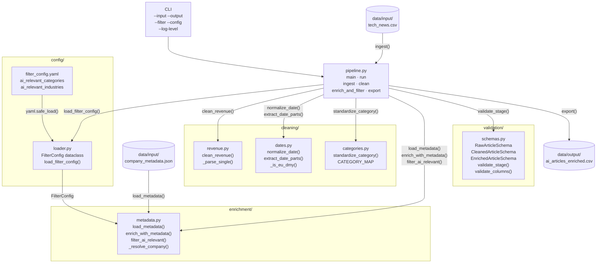
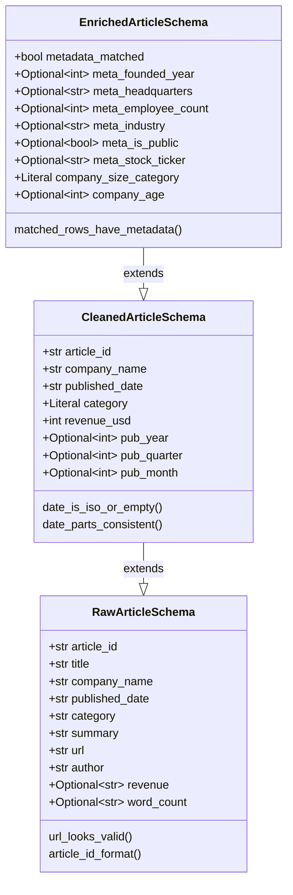
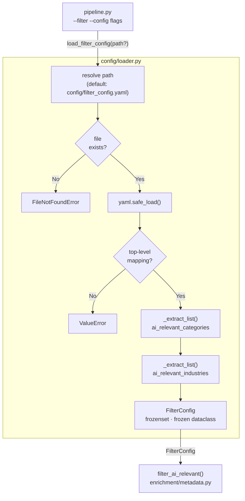

# Pipeline Architecture

## Module Dependency Graph

```mermaid
graph TD
    %% ── Entry point ────────────────────────────────────────────────────────
    CLI["CLI\n--input --output\n--filter --config\n--log-level"]
    MAIN["pipeline.py\nmain · run\ningest · clean\nenrich_and_filter · export"]

    CLI --> MAIN

    %% ── Cleaning layer ─────────────────────────────────────────────────────
    subgraph cleaning ["cleaning/"]
        REV["revenue.py\nclean_revenue()\n_parse_single()"]
        DAT["dates.py\nnormalize_date()\nextract_date_parts()\n_is_eu_dmy()"]
        CAT["categories.py\nstandardize_category()\nCATEGORY_MAP"]
    end

    MAIN -->|"clean_revenue()"| REV
    MAIN -->|"normalize_date()\nextract_date_parts()"| DAT
    MAIN -->|"standardize_category()"| CAT

    %% ── Config layer ────────────────────────────────────────────────────────
    subgraph config ["config/"]
        YAML["filter_config.yaml\nai_relevant_categories\nai_relevant_industries"]
        LOADER["loader.py\nFilterConfig dataclass\nload_filter_config()"]
    end

    YAML -->|"yaml.safe_load()"| LOADER
    MAIN -->|"load_filter_config()"| LOADER

    %% ── Enrichment layer ────────────────────────────────────────────────────
    subgraph enrichment ["enrichment/"]
        META["metadata.py\nload_metadata()\nenrich_with_metadata()\nfilter_ai_relevant()\n_resolve_company()"]
    end

    LOADER -->|"FilterConfig"| META
    MAIN -->|"load_metadata()\nenrich_with_metadata()\nfilter_ai_relevant()"| META

    %% ── Validation layer ────────────────────────────────────────────────────
    subgraph validation ["validation/"]
        SCH["schemas.py\nRawArticleSchema\nCleanedArticleSchema\nEnrichedArticleSchema\nvalidate_stage()\nvalidate_columns()"]
    end

    MAIN -->|"validate_stage()"| SCH

    %% ── External data ───────────────────────────────────────────────────────
    CSV_IN[("data/input/\ntech_news.csv")]
    JSON_IN[("data/input/\ncompany_metadata.json")]
    CSV_OUT[("data/output/\nai_articles_enriched.csv")]

    CSV_IN -->|"ingest()"| MAIN
    JSON_IN -->|"load_metadata()"| META
    MAIN -->|"export()"| CSV_OUT
```

---

## ETL Data Flow

```mermaid
flowchart LR
    A[/"tech_news.csv\n500 rows"/]

    subgraph S1 ["Stage 1 — Ingest"]
        B["ingest()\ncsv.DictReader"]
    end

    subgraph V1 ["Validate — Raw"]
        B1["RawArticleSchema\n• required fields non-empty\n• URL scheme check\n• article_id format"]
    end

    subgraph S2 ["Stage 2 — Clean"]
        C1["clean_revenue()\n£ € ¥ $ · B M K · ranges"]
        C2["normalize_date()\n7 formats · EU heuristic"]
        C3["standardize_category()\n19 raw → 6 canonical"]
    end

    subgraph V2 ["Validate — Cleaned"]
        D1["CleanedArticleSchema\n• revenue_usd ≥ 0\n• ISO date or empty\n• year/quarter/month ranges\n• date-parts consistency"]
    end

    subgraph S3 ["Stage 3 — Enrich"]
        E1["load_metadata()\ncompany_metadata.json"]
        E2["enrich_with_metadata()\nexact → fuzzy match\ncompany_age\ncompany_size_category"]
        E3{"--filter\nflag?"}
        E4["filter_ai_relevant()\nFilterConfig from YAML"]
    end

    subgraph V3 ["Validate — Enriched"]
        F1["EnrichedArticleSchema\n• metadata_matched consistency\n• employee_count ≥ 0\n• company_age in −10…300\n• size category literal"]
    end

    subgraph S4 ["Stage 4 — Export"]
        G["export()\ncsv.DictWriter\n22 columns"]
    end

    Z[/"ai_articles_enriched.csv"/]

    subgraph SEM ["Semantic Search (Part 2 & 3)"]
        SEM_P["search/pipeline.py\n• Generates embeddings\n• Computes similarities\n• Filters & Exports"]
        CSV_SEM[("filtered_ai_articles_with_embeddings.csv")]
    end

    A --> B --> V1 --> S2
    C1 & C2 & C3 --> V2 --> E1 --> E2 --> E3
    E3 -->|Yes| E4 --> V3
    E3 -->|No| V3
    V3 --> G --> Z
    Z -->|"read_csv()"| SEM_P
    SEM_P -->|"export_to_csv()"| CSV_SEM
```

---

## Validation Schema Hierarchy

```mermaid
classDiagram
    class RawArticleSchema {
        +str article_id
        +str title
        +str company_name
        +str published_date
        +str category
        +str summary
        +str url
        +str author
        +Optional~str~ revenue
        +Optional~str~ word_count
        url_looks_valid()
        article_id_format()
    }

    class CleanedArticleSchema {
        +str article_id
        +str company_name
        +str published_date
        +Literal category
        +int revenue_usd
        +Optional~int~ pub_year
        +Optional~int~ pub_quarter
        +Optional~int~ pub_month
        date_is_iso_or_empty()
        date_parts_consistent()
    }

    class EnrichedArticleSchema {
        +bool metadata_matched
        +Optional~int~ meta_founded_year
        +Optional~str~ meta_headquarters
        +Optional~int~ meta_employee_count
        +Optional~str~ meta_industry
        +Optional~bool~ meta_is_public
        +Optional~str~ meta_stock_ticker
        +Literal company_size_category
        +Optional~int~ company_age
        matched_rows_have_metadata()
    }

    CleanedArticleSchema --|> RawArticleSchema : extends
    EnrichedArticleSchema --|> CleanedArticleSchema : extends
```

---

## Config Loading

```mermaid
flowchart TD
    A["pipeline.py\n--filter --config flags"] -->|"load_filter_config(path?)"| B

    subgraph loader ["config/loader.py"]
        B["resolve path\n(default: config/filter_config.yaml)"]
        B --> C{"file\nexists?"}
        C -->|No| ERR1["FileNotFoundError"]
        C -->|Yes| D["yaml.safe_load()"]
        D --> E{"top-level\nmapping?"}
        E -->|No| ERR2["ValueError"]
        E -->|Yes| F["_extract_list()\nai_relevant_categories"]
        F --> G["_extract_list()\nai_relevant_industries"]
        G --> H["FilterConfig\nfrozenset · frozen dataclass"]
    end

    H -->|"FilterConfig"| I["filter_ai_relevant()\nenrichment/metadata.py"]
```
