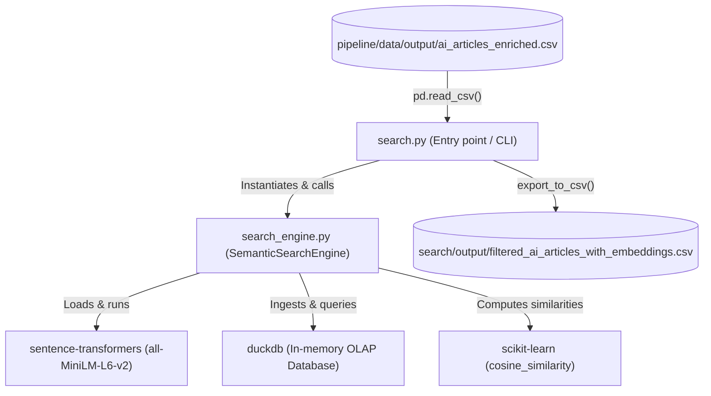
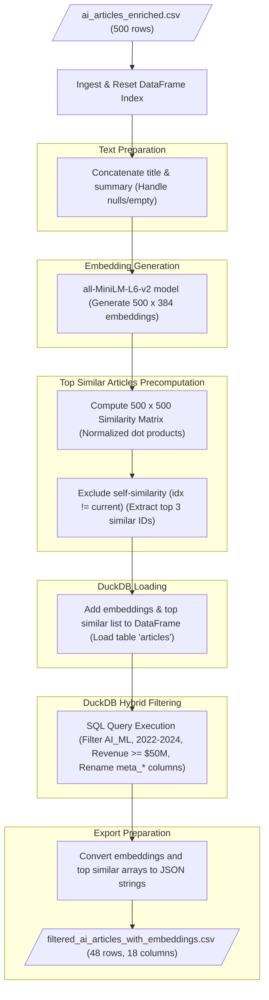
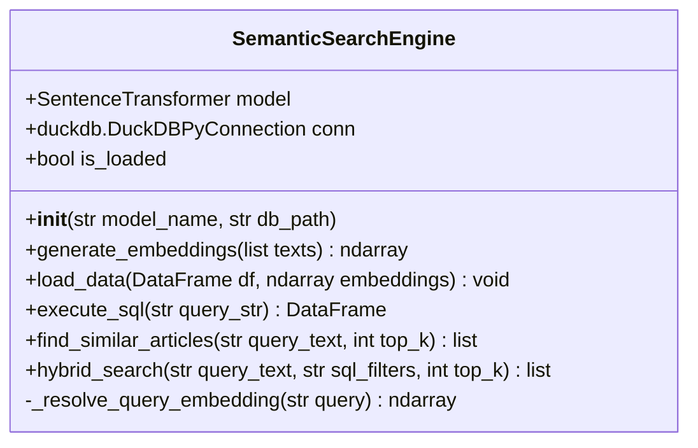
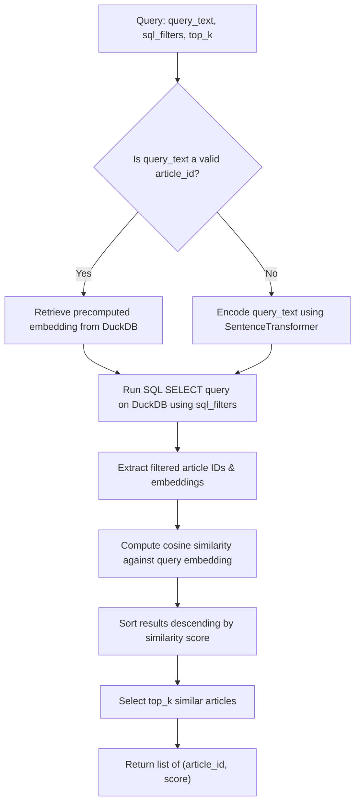

# Semantic Search Architecture & Design Diagrams

This document contains Mermaid diagrams illustrating the structure, dependencies, and data flows of the semantic search component.

---

## 1. Module Dependency Graph

The following diagram shows how the components in the `search` subdirectory relate to each other and to the external libraries and data resources:

---

## 2. Pipeline ETL & Semantic Search Data Flow

This diagram traces the sequence of data transformations and logic steps that occur when running `search.py`:

---

## 3. SemanticSearchEngine Class Structure

Below is the class diagram for the core semantic search controller:

---

## 4. Hybrid Search Query Execution Flow

This diagram illustrates how the `hybrid_search()` method integrates SQL-based database queries with vector similarity calculations:

